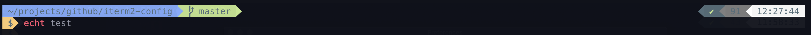
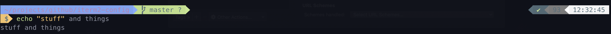
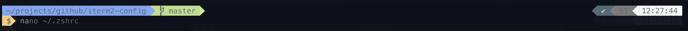
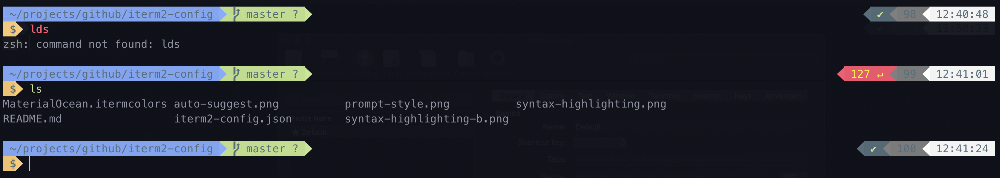

# iterm2-config
A perfect setup for iTerm2

## Features
Clear prompt style , execution context, VCS status:

Syntax highlighting:

Auto suggestions based on bash history:

Visible exit codes:

## Guide
Install iTerm:

`$ brew cask install iterm2`

Install font:
https://github.com/powerline/fonts/blob/master/Meslo%20Slashed/Meslo%20LG%20M%20Regular%20for%20Powerline.ttf

Import `iterm2-config.js` as your iterm proflie.

Import and set colour scheme to `MaterialOcean.itermcolors`.

Install zsh:

`$ brew install zsh zsh-completions`

Install Oh-my-zhs - allow your default shell to become zsh:

`$ sh -c "$(curl -fsSL https://raw.github.com/robbyrussell/oh-my-zsh/master/tools/install.sh)"`

Get the powerlevel9k theme for zsh:

`$ git clone https://github.com/bhilburn/powerlevel9k.git ~/.oh-my-zsh/custom/themes/powerlevel9k`

Install auto suggestions plugin:

`$ git clone https://github.com/zsh-users/zsh-autosuggestions ~/.zsh/zsh-autosuggestions`

Install syntax highlighting:
`$ brew install zsh-syntax-highlighting`

## Cool Tricks
* option + -> will skip forward a word
* option + <- will skip back a word
* option + backspace will delete a word
* auto suggestions - press -> to complete

## References
See: https://medium.com/@Clovis_app/configuration-of-a-beautiful-efficient-terminal-and-prompt-on-osx-in-7-minutes-827c29391961