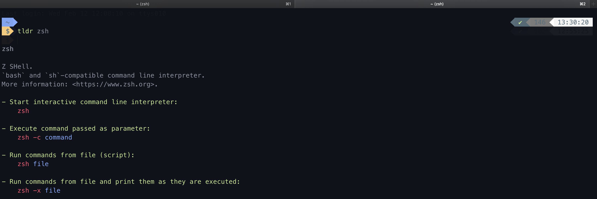
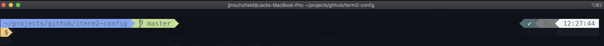
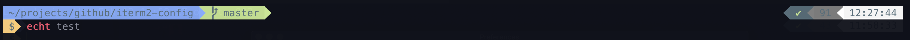
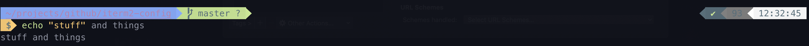
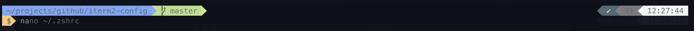

# iterm2-config
A perfect setup for iTerm2 using `zsh` with a [powerlevel9k](https://github.com/bhilburn/powerlevel9k.git) and a Material Ocean color scheme.



## Features
Clear prompt style , execution context, VCS status:



Syntax highlighting:





Auto suggestions based on bash history:



Visible exit codes:


## Guide
Grab the config files from this repo:

`git clone https://github.com/jjmschofield/iterm2-config`

Install iTerm:

`$ brew cask install iterm2`

Install font:

https://github.com/powerline/fonts/blob/master/Meslo%20Slashed/Meslo%20LG%20M%20Regular%20for%20Powerline.ttf

Import `iterm2-config.js` as your iTerm profile.

Import and set color scheme to `MaterialOcean.itermcolors`.

Install zsh:

`$ brew install zsh zsh-completions`

Install Oh-my-zhs - allow your default shell to become zsh:

`$ sh -c "$(curl -fsSL https://raw.github.com/robbyrussell/oh-my-zsh/master/tools/install.sh)"`

Get the powerlevel9k theme for zsh:

`$ git clone https://github.com/bhilburn/powerlevel9k.git ~/.oh-my-zsh/custom/themes/powerlevel9k`

Install auto suggestions plugin:

`$ git clone https://github.com/zsh-users/zsh-autosuggestions ~/.zsh/zsh-autosuggestions`

Install syntax highlighting:

`$ brew install zsh-syntax-highlighting`

Copy in the `.zshrc` file. Note this will source your existing `~/.bash_profile` - you may need to modify this based on OS.

`$ cp -f .zshrc ~./.zshrc`

The `.zshrc` is optimized for OSX and has *opinions* review it's contents and tweak as you see fit (specifically plugins).

## Bonus
### Syntax highlighting in nano
Install:

`$ brew install nano`

Restart your terminal session (otherwise you will be pointing to the mac installed version of nano).

```
$ touch ~/.nanorc
$ find /usr/local/Cellar/nano/ -iname "*.nanorc" -exec echo include {} \; >> ~/.nanorc
```

### Visual Studio Code
You might get:

```
$ vsc
zsh: command not found: code
```

You will need to install the `code` command in your path - [see how.](https://stackoverflow.com/questions/29955500/code-not-working-in-command-line-for-visual-studio-code-on-osx-mac)

### Webstorm
Switch over to using `zsh` in Webstorm [following this reference](https://www.jetbrains.com/help/webstorm/settings-tools-terminal.html).

Find the console font setting and set it to `Meslo LG M for Powerline`

## Cool Tricks
* option + -> will skip forward a word
* option + <- will skip back a word
* option + backspace will delete a word
* auto suggestions - press -> to complete

## References
This is heavily based on [this great article](https://medium.com/@Clovis_app/configuration-of-a-beautiful-efficient-terminal-and-prompt-on-osx-in-7-minutes-827c29391961).
